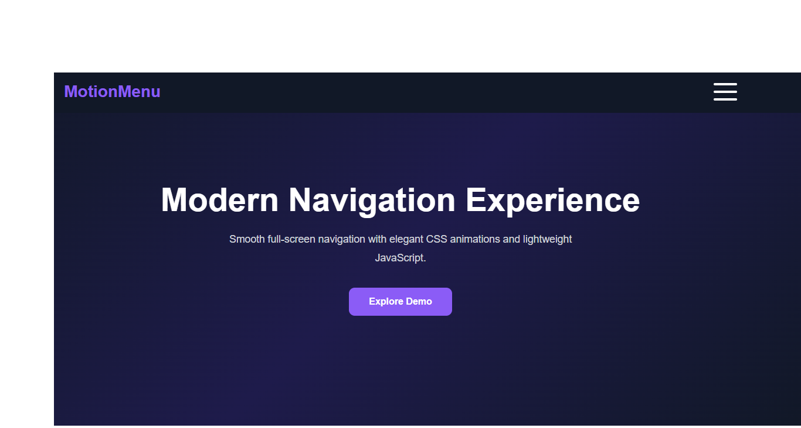

# MotionMenu Overlay

A responsive full-screen navigation menu built with HTML, CSS, and JavaScript.

## ✨ Features

- Responsive design
- Full-screen menu overlay
- Hamburger menu animation
- Smooth CSS transitions
- Mobile-first layout
- Pure HTML, CSS and JavaScript

## 📸 Preview



## 🚀 Live Demo

(https://amr-elrahmany.github.io/motionmenu-overlay/)

## 🛠 Technologies Used

- HTML5
- CSS3
- JavaScript (ES6)

## 📂 Project Structure

```
motionmenu-overlay
│
├── index.html
├── styles.css
├── script.js
├── preview.png
└── README.md
```

## 👨‍💻 Author

**Amr Elrahmany**

GitHub:
https://github.com/Amr-Elrahmany
